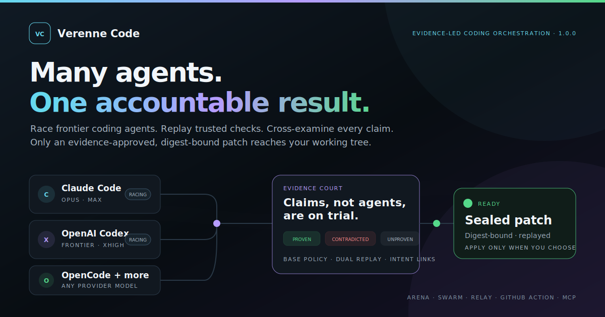

# Verenne Code

**Many agents. One accountable result.**



[](https://github.com/ShiningSon/verenne/actions/workflows/ci.yml)
[](LICENSE)

Verenne Code is an evidence-led coding interface for Claude Code, OpenAI Codex, OpenCode, Gemini CLI, Aider, and custom agents. It gives several agents isolated attempts, replays trusted checks independently, cross-examines what each agent claims, and lets only an evidence-approved patch reach your working tree.

The product is local-first, dependency-free at runtime, and designed for one-command use.

## Install and start

Requirements: Node.js 20+, Git, and at least one supported coding-agent CLI.

The current one-line source install is available from the public GitHub repository:

```bash
npx --yes github:ShiningSon/verenne
```

After [`verenne@1.0.0` is visible on npm](https://www.npmjs.com/package/verenne), the shorter command becomes the recommended stable-release path:

```bash
npx verenne
```

Until that npm page shows a published version, use the GitHub command above. Both paths start the interactive session without a global Verenne install. Verenne detects installed agents, asks for the change in plain language, and chooses safe defaults. No Verenne account, daemon, or mandatory config file is required.

For a non-interactive run:

```bash
npx --yes github:ShiningSon/verenne run "Fix the authentication race and add regression coverage" --profile frontier
```

Then inspect and apply the result:

```bash
npx --yes github:ShiningSon/verenne dashboard latest
npx --yes github:ShiningSon/verenne apply latest
```

`apply` requires a clean working tree, the verified base commit, and an untampered sealed patch. It never commits unless `--commit` is explicitly supplied.

## What happens after you press Enter

1. Verenne turns the request into an Intent Contract.
2. Relevant repository context and local project memory are compiled.
3. Agents work in separate, managed Git worktrees.
4. Candidate patches are sealed to the base commit and trusted policy.
5. Tests, builds, lint, and custom gates are replayed from clean verification worktrees.
6. Every claim becomes `PROVEN`, `CONTRADICTED`, or `UNPROVEN`.
7. Required outcomes must link to changed paths or passing gates and to specifically proven claim IDs.
8. The standalone case file explains the decision; the user chooses whether to apply it.

An agent cannot win by changing the test command, deleting tests, focusing a test, editing the verification policy, or merely saying that something passed.

### Outcome-to-evidence linkage

The original request is split into required Intent Contract items. A candidate result maps each item to observed changed paths, base-owned gate IDs, and explicit claim IDs. A reported `completed` status or an unrelated green test is not delivery: under the default strict policy, every required intent item must reach `EVIDENCED`, every required claim must be `PROVEN`, and at least one independently replayed gate must pass.

### Dual replay when verification inputs change

Every gate starts from a hard-reset worktree, reapplies the sealed binary patch, bootstraps dependencies, and checks that the gate itself did not mutate the verification tree. If the candidate adds, removes, or renames tests, runners, manifests, lockfiles, or other verification inputs, Verenne also restores the trusted base versions and runs a baseline suite. Candidate tests can demonstrate new behavior; they cannot replace the base's acceptance boundary.

## Three ways to work

- **Arena** runs the same task through several agents and selects one patch.
- **Swarm** runs a dependency graph, passing only verified dependency patches forward.
- **Relay** hands one worktree from scout to builder to critic to fixer.

Arena is the default because it needs no planning ceremony. Swarm and Relay are available when the shape of the work calls for them.

## Frontier models without lock-in

Verenne uses each provider's native model controls. Built-in adapters pass arbitrary full model identifiers through to the installed CLI, so a new model does not require a Verenne release. Model availability still depends on the provider account and CLI version.

```bash
npx --yes github:ShiningSon/verenne run "Implement the feature" \
  --agents claude,codex,opencode \
  --model claude=opus \
  --model codex=gpt-5.6-sol \
  --model opencode=anthropic/your-model-id \
  --effort claude=max \
  --effort codex=xhigh
```

| Adapter | Non-interactive transport | Model control | Reasoning control |
| --- | --- | --- | --- |
| Claude Code | stdin + print JSON | `--model` | `--effort` |
| OpenAI Codex | stdin + JSONL `exec` | `--model` | `model_reasoning_effort` |
| OpenCode | prompt file + JSON events | `--model provider/model` | `--variant` |
| Gemini CLI | stdin + JSON | `--model` | provider default |
| Aider | message file | `--model` | `--reasoning-effort` |

Authentication remains owned by each installed CLI. Verenne forwards only an allowlist of task-relevant environment variables and never copies unrelated host secrets into an agent process.

Keep provider CLIs current when a newly released model ID is rejected. Verenne does not modify provider installations for you; `verenne doctor` reports what it detects.

| CLI | Official update path |
| --- | --- |
| Claude Code | [`claude update`](https://code.claude.com/docs/en/getting-started#update-claude-code) |
| OpenAI Codex | Follow the [official Codex CLI update path](https://developers.openai.com/codex/cli/) for the installation method; npm: `npm install -g @openai/codex@latest` |
| OpenCode | [`opencode upgrade`](https://opencode.ai/docs/cli/#upgrade) |
| Gemini CLI | [`npm install -g @google/gemini-cli@latest`](https://geminicli.com/docs/resources/faq/#how-do-i-update-gemini-cli-to-the-latest-version) for npm installations |
| Aider | [`aider --upgrade`](https://aider.chat/docs/config/options.html#--upgrade) |

Use the updater matching the installation method; managed package installations may have a different command.

## Interface

The command center keeps the whole mission in one composition:

- sessions and the task graph on the left;
- a conversational execution stream in the center;
- live agents, diff scope, and evidence on the right;
- a follow-up composer at the bottom;
- an Arena drawer for exact candidate comparisons.

Only active work receives the slow aurora sweep. Completed work settles into its verdict color, and `prefers-reduced-motion` removes animation entirely. Keyboard navigation includes `/`, `j/k`, `Ctrl/Command+K`, and `Escape`.

## Zero configuration and project policy

Verenne discovers common gates from `package.json`, `go.mod`, `Cargo.toml`, and Python project files. Run `verenne init` only when the repository needs committed policy or custom adapters. It creates:

- `verenne.config.json` for adapters, profiles, concurrency, and context;
- `verenne.policy.json` for base-owned gates and trust rules.

Configuration is ordinary JSON. A custom agent needs only a command, structured argument templates, and its prompt transport.

Dependency setup has two trust modes. The initial agent lane may use the host package credentials allowed by the base-owned policy. Independent candidate replay uses a temporary home, removes host registry tokens and proxy settings, and points npm bootstrap at the public registry. Base-restored replay may use the trusted environment to reproduce the repository baseline. This keeps a candidate patch from turning dependency setup into a credential-extraction step; private-registry projects should validate their dependency strategy on an isolated runner before adopting the default automatic bootstrap.

## Useful commands

```text
verenne                         interactive session
verenne run "<task>"            run a mission
verenne doctor                  detect agents and compatibility
verenne status [mission]        show a decision
verenne dashboard [mission]     open the command center
verenne report [mission]        rebuild a share-safe case file
verenne verify                  verify the current patch
verenne apply [mission]         apply the sealed winner
verenne clean [mission]         remove managed worktrees
verenne memory add|search|list  manage local project memory
verenne mcp                     expose repository-pinned MCP tools
```

Use `verenne demo` only for the optional zero-key product tour. It is not the product runtime.

Pressing `Ctrl+C` or sending `SIGTERM` cancels an active CLI mission, terminates provider, bootstrap, and gate process trees, waits for parallel lanes to settle, records the mission as `cancelled`, and exits nonzero (`130` for `SIGINT`, `143` for `SIGTERM`). Managed worktrees remain available for inspection until `verenne clean` removes them.

## GitHub Action

```yaml
- uses: actions/checkout@v6
  with:
    fetch-depth: 0
- id: verenne
  uses: ShiningSon/verenne@v1
  with:
    task: ${{ github.event.pull_request.title }}
    claims: pr-body
```

Each Markdown list item in the pull-request body becomes a required claim when `claims: pr-body` is used. For stable claim IDs and kinds, pass a repository JSON claim file instead. The action derives the trusted base from the pull-request or merge-queue event, verifies outcome/claim linkage against base-owned policy, and writes a job summary plus share-safe HTML, JSON, SVG, and SARIF files. Their paths are exposed as action outputs; upload them with the artifact or SARIF action used by your repository.

## Security model

Verenne is a verifier and orchestrator, not a virtual machine. Git worktrees isolate candidate changes from one another but do not sandbox operating-system access. Agent CLIs can execute tools with the permissions of the current user. Use provider permission controls, containers, or an isolated CI worker for untrusted repositories.

Important defaults:

- dashboards bind to loopback only;
- share artifacts redact prompts, credentials, environment values, and local paths;
- trusted gates and policy come from the base commit;
- candidate bootstrap and gate replay run without host credentials in isolated homes;
- verification-input changes trigger candidate and base-restored replay suites;
- candidate PATH entries cannot shadow trusted executables;
- context and evidence readers reject paths and symlinks that escape allowed roots;
- cancellation propagates to active process trees before the CLI returns;
- no patch is automatically merged or committed.

See [SECURITY.md](SECURITY.md) for reporting and deployment guidance.

## Development

```bash
npm ci
npm run check
npm pack --dry-run
```

The runtime has zero third-party dependencies. Tests cover evidence replay, false-green attempts, selection, report redaction, live server behavior, CLI packaging, Unicode paths, process termination, and path boundaries across supported platforms.

## License

Apache-2.0. See [LICENSE](LICENSE).
